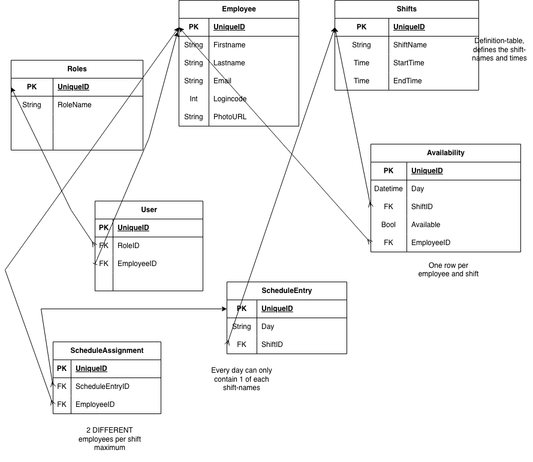

#Employee scheduler

To install:
```npm install```

To run:
Make sure .env contains your PRISMA DATABASE_URL connection-string. 
```npm run dev```

To check for errors:
```npm run lint```

To fix errors:
```npm run lint:fix```


Installation-notes Prisma (follwed the official Prisma-docs)

npm install prisma@7.10.0 tsx @types/pg dotenv --save-dev
npm install @prisma/client@7.10.0 @prisma/adapter-pg pg

npx prisma init --output ../generated/prisma

Notes from schema and migration for prisma
- Created schemas according to this diagram:


- Created migrations through running this command:
npx prisma migrate dev --name creating-tables